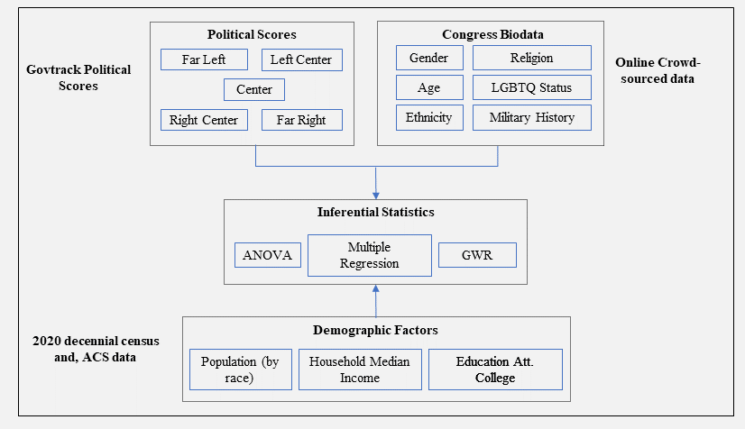

# Socio-economic Determinants of Partisan Politics

This repository hosts the code used in the research for determining the socio-economic determinants of partisan politics. The project focuses on analyzing how various socio-economic factors contribute to political polarization.

### Prerequisites

Before you begin, ensure you have the following installed:

- R (latest version)
- Python to create and prepare the dataset

### Installation

To replicate this work using the prepared dataset, follow these steps:

1. Clone the repository:
2. Change directory into the project folder:
3. Create a new folder named `data` in the project directory:
4. Download the final dataset from [Zenodo](https://zenodo.org/records/10253394) and unzip it into the `data` directory.

### Running the Analysis

To perform the analysis:

1. Navigate to the `viz` folder:
2. Run the R script to generate visualizations: Make sure necessary modules are installed.

## Methodology

Here is a visual representation of the project's methodology:

